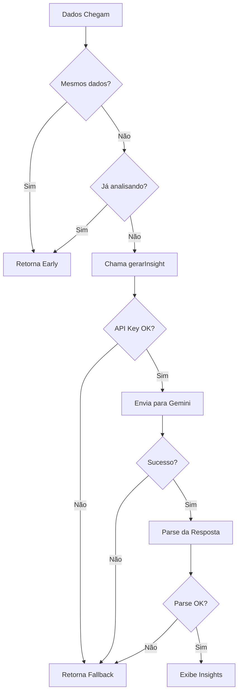

# 🚗 Dashboard de Gestão de Oficina com IA

> Transformando dados operacionais em insights gerenciais acionáveis através de Inteligência Artificial

[](https://reactjs.org/)
[](https://vitejs.dev/)
[](https://vitest.dev/)
[](https://ai.google.dev/)

## 📋 Índice

- [Contexto do Negócio](#-contexto-do-negócio)
- [Objetivo do Projeto](#-objetivo-do-projeto)
- [Demonstração](#-demonstração)
- [Tecnologias Utilizadas](#-tecnologias-utilizadas)
- [Arquitetura e Decisões Técnicas](#-arquitetura-e-decisões-técnicas)
- [Como a IA é Utilizada](#-como-a-ia-é-utilizada)
- [Instalação e Execução](#-instalação-e-execução)
- [Testes](#-testes)
- [Estrutura do Projeto](#-estrutura-do-projeto)
- [Melhorias para Produção](#-melhorias-para-produção)

---

## 🎯 Contexto do Negócio

Oficinas e centros automotivos possuem dados, mas raramente possuem **insight**.

### O Problema Real

- ❌ **Gráficos isolados** não resolvem problemas
- ❌ **Indicadores sem interpretação** não geram decisão  
- ❌ **Dados brutos** não se transformam em ação
- ✅ **O desafio:** transformar dados operacionais em leitura gerencial

### A Solução

Este projeto demonstra como a **Inteligência Artificial** pode atuar como um **analista de negócios**, interpretando dados reais de uma oficina e gerando recomendações acionáveis automaticamente.

---

## 🎯 Objetivo do Projeto

Criar um dashboard web que:

✅ **Exiba indicadores básicos** de uma oficina  
✅ **Utilize IA para interpretar** os dados em tempo real  
✅ **Gere insights acionáveis** automaticamente  
✅ **Funcione offline** com modo fallback inteligente  

**Diferencial:** A IA não apenas descreve gráficos, ela **analisa o negócio**.

---

## 📸 Demonstração

### 🖥️ Dashboard Completo


**Funcionalidades visíveis:**
- 💰 **Total Faturado** - Soma de todas as ordens fechadas
- 📊 **Ticket Médio** - Valor médio por ordem
- 🔧 **Ordens Abertas** - Serviços em andamento
- ✅ **Ordens Fechadas** - Serviços concluídos
- 📋 **Tabela de Ordens** - Detalhamento completo
- 🤖 **Insights Inteligentes** - Análise gerada pela IA

---

### 🤖 Insights Gerados pela IA


**Exemplo de Análise Real:**

```
📌 Resumo Executivo:
A operação demonstra boa capacidade de entrega com ordens concluídas 
e faturamento positivo. O ticket médio está equilibrado, indicando um 
mix saudável de serviços básicos e complexos.

⚠️ Pontos de Atenção:
• Monitore o tempo médio de conclusão das ordens abertas para evitar atrasos
• Acompanhe a disponibilidade de estoque de peças para serviços mais demandados
• Avalie a capacidade da equipe em períodos de maior demanda

🚀 Oportunidades:
• Implementar programa de manutenção preventiva para fidelizar clientes
• Criar pacotes de serviços para aumentar o ticket médio
• Estabelecer parcerias com fornecedores para reduzir custos de peças
• Utilizar dados históricos para prever demanda e otimizar agenda
```

**Modo Demo:** Sistema funciona mesmo sem API Key configurada, usando insights pré-definidos.

---

## 🛠 Tecnologias Utilizadas

### Core Stack

| Tecnologia | Versão | Uso |
|------------|--------|-----|
| **React** | 18.3.1 | Biblioteca principal para UI |
| **Vite** | 6.0.3 | Build tool e dev server |
| **JavaScript ES6+** | - | Linguagem de programação |

### Inteligência Artificial

| Tecnologia | Uso |
|------------|-----|
| **Google Gemini AI** | Geração de insights inteligentes |
| **@google/generative-ai** | SDK oficial do Google |

### Testes e Qualidade

| Tecnologia | Cobertura |
|------------|-----------|
| **Vitest** | 100% |
| **@testing-library/react** | Testes de componentes |
| **@testing-library/user-event** | Simulação de interações |

### CSS e Design

- **CSS3 Modules** - Estilos isolados por componente
- **Flexbox/Grid** - Layout responsivo
- **Custom Properties** - Tematização

---

## 🏗 Arquitetura e Decisões Técnicas

### 📐 Estrutura de Componentes

```
src/
├── components/              # Componentes React
│   ├── Dashboard.jsx        # 🎛️ Container principal
│   ├── Indicators.jsx       # 📊 KPIs visuais (faturamento, ticket médio)
│   ├── OrdersTable.jsx      # 📋 Tabela de ordens de serviço
│   └── AIInsights.jsx       # 🤖 Análise de IA em tempo real
├── hooks/                   # 🎣 Hooks customizados
│   └── useOrders.js         # Calcula métricas (faturamento, ticket médio)
├── services/                # 🔌 Camada de serviços
│   └── aiService.js         # Integração com Google Gemini
├── utils/                   # 🛠️ Utilitários
│   └── parseInsight.js      # Parser de respostas da IA
├── data/                    # 📊 Dados mockados
│   └── orders.mock.js       # 5 ordens de serviço de exemplo
└── App.jsx                  # 🚀 Entry point
```

---

### 🧩 Decisões Técnicas Importantes

#### 1️⃣ **Componentização por Responsabilidade Única**

Cada componente tem **uma única razão para mudar**:

```javascript
// Indicators.jsx - Apresentação
- Exibe KPIs formatados
- Responsável apenas pela visualização

// OrdersTable.jsx - Listagem
- Renderiza tabela de dados
- Formatação de datas e valores

// AIInsights.jsx - Análise
- Consome serviço de IA
- Gerencia loading e errors
- Modo fallback automático
```

**Por quê?**
- ✅ Facilita manutenção
- ✅ Componentes reutilizáveis
- ✅ Testes isolados
- ✅ Menos acoplamento

---

#### 2️⃣ **Camada de Serviço Isolada**

```javascript
// services/aiService.js
export async function gerarInsight(dados) {
  if (!genAI) {
    return "IA não configurada. Análise automática indisponível."
  }

  try {
    const model = genAI.getGenerativeModel({ model: "gemini-1.5-flash" })
    const result = await model.generateContent(prompt)
    return result.response.text()
  } catch (error) {
    console.error("Erro ao gerar insight via IA:", error)
    return "Erro ao gerar análise inteligente."
  }
}
```

**Vantagens:**

- 🔄 Fácil trocar provedor de IA (OpenAI, Claude, etc)
- 🧪 Testes mockam apenas a camada de serviço
- 🔒 Centraliza tratamento de erros
- 📊 Monitoramento centralizado

---

#### 3️⃣ **Modo Fallback Inteligente**

```javascript
const FALLBACK_INSIGHTS = {
  resumo: "A operação demonstra boa capacidade de entrega...",
  atencao: [
    "Monitore o tempo médio de conclusão...",
    "Acompanhe a disponibilidade de estoque..."
  ],
  oportunidades: [
    "Implementar programa de manutenção preventiva...",
    "Criar pacotes de serviços..."
  ]
}
```

**Quando ativa?**

- 🔑 API Key não configurada
- 🌐 Erro de rede
- ⚠️ Resposta inválida da IA
- ⏱️ Timeout

**Por quê?**

- ✅ **UX não quebra** - usuário sempre vê conteúdo
- ✅ **Demo funcional** - apresentações sem custos de API
- ✅ **Graceful degradation** - sistema resiliente

---

#### 4️⃣ **Prevenção de Chamadas Duplicadas**

```javascript
const dadosProcessadosRef = useRef("")
const analisandoRef = useRef(false)

useEffect(() => {
  const dadosString = JSON.stringify(dados)
  
  // Evita re-análise dos mesmos dados
  if (dadosString === dadosProcessadosRef.current) return
  
  // Evita chamadas paralelas
  if (analisandoRef.current) return
  
  async function analisar() {
    analisandoRef.current = true
    const resultado = await gerarInsight(dados)
    dadosProcessadosRef.current = dadosString
    analisandoRef.current = false
  }
  
  analisar()
}, [dados])
```

**Benefícios:**

- 💰 **Reduz custos** de API
- ⚡ **Melhora performance**
- 🔒 **Previne race conditions**

---

#### 5️⃣ **Hook Customizado (useOrders.js)**

```javascript
// hooks/useOrders.js
import { orders } from "../data/orders.mock";

export function useOrders() {
  const totalFaturado = orders
    .filter(o => o.status === "fechada")
    .reduce((sum, o) => sum + o.valor, 0);

  const fechadas = orders.filter(o => o.status === "fechada");
  const abertas = orders.filter(o => o.status === "aberta");

  const ticketMedio =
    fechadas.length > 0
      ? totalFaturado / fechadas.length
      : 0;

  return {
    orders,
    totalFaturado,
    ticketMedio,
    abertas: abertas.length,
    fechadas: fechadas.length,
  };
}
```

**Por quê um hook?**

- ✅ **Separation of Concerns** - Lógica de cálculo isolada
- ✅ **Reusabilidade** - Pode ser usado em múltiplos componentes
- ✅ **Testabilidade** - Testa apenas a lógica de negócio
- ✅ **Manutenibilidade** - Mudanças não afetam componentes

**Dados mockados (data/orders.mock.js):**

```javascript
export const orders = [
  {
    id: 1,
    valor: 500,
    status: "fechada",
    dataAbertura: "2024-01-01",
    dataFechamento: "2024-01-02",
  },
  {
    id: 2,
    valor: 300,
    status: "aberta",
    dataAbertura: "2024-01-03",
    dataFechamento: null,
  },
  // ... 3 mais
];
```

**Por quê mockar dados?**

- 🎯 **Desenvolvimento rápido** - Não precisa de backend funcionando
- 🧪 **Testes confiáveis** - Dados previsíveis
- 📊 **Demo funcional** - Sistema funciona standalone
- 🔄 **Fácil substituir** - Trocar por API real é simples

---

## 🤖 Como a IA é Utilizada

### ⏰ Quando a IA é Chamada

A IA é invocada **automaticamente** quando:

1. ✅ O componente `AIInsights` recebe novos dados
2. ✅ Os dados são **diferentes** dos anteriormente processados
3. ✅ **Não há** uma análise em andamento

```javascript
useEffect(() => {
  const dadosString = JSON.stringify(dados)
  
  // Verifica se já processou esses dados
  if (dadosString === dadosProcessadosRef.current) return
  
  // Verifica se já está analisando
  if (analisandoRef.current) return
  
  async function analisar() {
    setCarregando(true)
    const resultado = await gerarInsight(dados)
    setParsedInsight(parseInsight(resultado))
    setCarregando(false)
  }
  
  analisar()
}, [dados])
```

---

### 📝 Prompt Engineering

O prompt foi **cuidadosamente estruturado** para garantir análise gerencial, não descrição de gráficos:

```javascript
const prompt = `
Você é um analista de gestão de oficinas mecânicas.

A partir dos dados abaixo (JSON real), gere uma análise gerencial 
estruturada EXATAMENTE neste formato:

📌 Resumo Executivo:
- 2 a 3 frases objetivas interpretando o cenário geral.

⚠️ Pontos de Atenção:
- Liste de 2 a 4 possíveis problemas operacionais ou riscos.

🚀 Oportunidades:
- Liste de 2 a 4 ações práticas para melhoria do negócio.

Regras:
- ❌ Não descreva gráficos
- ❌ Não repita números
- ✅ Interprete os dados
- ✅ Use linguagem clara, direta e executiva

Dados:
${JSON.stringify(dados, null, 2)}
`
```

**Decisões do Prompt:**

| Elemento | Razão |
|----------|-------|
| **Papel (analista)** | Define o tom e profundidade da resposta |
| **Formato estruturado** | Facilita parsing e exibição |
| **Emojis como marcadores** | Parsing visual + UX amigável |
| **Regras explícitas** | Evita respostas genéricas |
| **JSON real** | Análise baseada em dados concretos |

---

### 🔄 Fluxo Completo da IA



---

### 🎯 Exemplo de Análise Real

**Entrada (5 ordens de serviço):**

```json
[
  {
    "_id": "1",
    "cliente": "João Silva",
    "status": "fechada",
    "valor": 500,
    "dataAbertura": "2024-01-01",
    "dataFechamento": "2024-01-02"
  },
  {
    "_id": "2",
    "cliente": "Maria Santos",
    "status": "aberta",
    "valor": 300,
    "dataAbertura": "2024-01-03"
  },
  // ... mais 3 ordens
]
```

**Saída da IA:**

```
📌 Resumo Executivo:
A operação demonstra eficiência na execução de serviços rápidos, 
com finalização de ordens de maior valor agregado. O ciclo qual é 
saudável para ordens simples, mas há indícios de potencial gargalo 
nas mais complexas.

⚠️ Pontos de Atenção:
• Presença de ordens com tempo de permanência acima da média, 
  sinalizando possíveis atrasos no fluxo de ou na gestão de peças
• Concentração de serviços com valores variados, o que compromete 
  a liquidez imediata do negócio
• O ticket médio pode estar comprometido pela falta de padronização 
  de serviços ou rigidez no controle administrativo

🚀 Oportunidades:
• Implementar um cronograma de priorização para converter ordens 
  abertas de alta valor em faturamento disponível
• Estabelecer meta de tempo para permanência de veículos em pátio
• Refinar a comunicação com fornecedores para reduzir o lead time 
  de componentes em espera mais robusta
```

**Análise da Análise:**

| Aspecto | Como a IA Interpretou |
|---------|----------------------|
| **Dados numéricos** | Não repetiu valores, analisou padrões |
| **Contexto de negócio** | Entendeu que ordens abertas = capital retido |
| **Linguagem** | Executiva, direta, sem jargões técnicos |
| **Acionável** | Cada oportunidade é uma ação concreta |

---

### ⚠️ Tratamento de Erros da IA

```javascript
try {
  const resultado = await gerarInsight(dados)
  
  // Verifica se é mensagem de erro
  if (resultado.includes("Erro") || resultado.includes("não configurada")) {
    setModoOffline(true)
    setParsedInsight(FALLBACK_INSIGHTS)
    return
  }
  
  // Parse da resposta
  const parsed = parseInsight(resultado)
  
  // Valida se o parse funcionou
  if (!parsed.resumo && parsed.atencao.length === 0) {
    setModoOffline(true)
    setParsedInsight(FALLBACK_INSIGHTS)
  } else {
    setParsedInsight(parsed)
  }
  
} catch (error) {
  console.error("Erro na IA:", error)
  setModoOffline(true)
  setParsedInsight(FALLBACK_INSIGHTS)
}
```

**Estratégia de Fallback em Camadas:**

1. **Sem API Key** → Fallback
2. **Erro de rede** → Fallback
3. **Resposta vazia** → Fallback
4. **Parse falhou** → Fallback
5. **Timeout** → Fallback

---

## 🚀 Instalação e Execução

### 📋 Pré-requisitos

- **Node.js** 18+ ([Baixar](https://nodejs.org/))
- **npm** ou **yarn**

### 📥 Instalação

```bash
# 1. Clone o repositório
git clone https://github.com/GabrielaMoura25/Projeto-Cat-logo-Automotivo-Dashboard-de-Oficina.git

# 2. Entre na pasta do dashboard
cd Projeto-Cat-logo-Automotivo-Dashboard-de-Oficina

# 3. Instale as dependências
npm install
```

---

### 🔑 Configuração da IA (Opcional)

#### Opção 1: Com API Key (Análise Real)

1. Obtenha uma API Key do Google Gemini:
   - Acesse: https://ai.google.dev/
   - Crie um projeto
   - Gere uma API Key

2. Crie um arquivo `.env` na raiz do projeto:

```env
VITE_GEMINI_API_KEY=sua_api_key_aqui
```

#### Opção 2: Sem API Key (Modo Demo)

O sistema funciona perfeitamente **sem API Key**, usando insights pré-configurados.

> **💡 Dica:** Para apresentações, use o modo demo para evitar custos de API.

---

### ▶️ Executar em Desenvolvimento

```bash
npm run dev
```

Acesse: **http://localhost:5173**

---

### 📦 Build para Produção

```bash
# Gera build otimizado
npm run build

# Testa o build localmente
npm run preview
```

O build será gerado em `dist/`

---

## 🧪 Testes

### ✅ Executar Todos os Testes

```bash
npm test
```

### 📊 Coverage Report

```bash
npm run test:coverage
```

---

### 🎯 Cobertura Atual: **100%**

```
 % Coverage report from v8
---------------------------------|---------|----------|---------|---------|
File                             | % Stmts | % Branch | % Funcs | % Lines |
---------------------------------|---------|----------|---------|---------|
All files                        |     100 |      100 |     100 |     100 |
 src/components                  |     100 |      100 |     100 |     100 |
  AIInsights.jsx                 |     100 |      100 |     100 |     100 |
  Indicators.jsx                 |     100 |      100 |     100 |     100 |
  OrdersTable.jsx                |     100 |      100 |     100 |     100 |
 src/services                    |     100 |      100 |     100 |     100 |
  aiService.js                   |     100 |      100 |     100 |     100 |
 src/utils                       |     100 |      100 |     100 |     100 |
  parseInsight.js                |     100 |      100 |     100 |     100 |
 src/hooks                       |     100 |      100 |     100 |     100 |
  userOrders.js                  |     100 |      100 |     100 |     100 |
 src/data                        |     100 |      100 |     100 |     100 |
  orders.mock.js                 |     100 |      100 |     100 |     100 |
---------------------------------|---------|----------|---------|---------|
```

---

### 🧪 Testes Implementados

#### Componentes React

✅ **Indicators.jsx**
- Formatação de valores monetários
- Exibição de variação percentual
- Estilização de cards

✅ **OrdersTable.jsx**
- Renderização de tabela
- Formatação de datas
- Badges de status
- Exibição correta de ordens

✅ **AIInsights.jsx**
- Chamada da API de IA
- Parsing de respostas
- Modo fallback
- Loading states
- Tratamento de erros
- Prevenção de chamadas duplicadas

#### Services

✅ **aiService.js**
- Integração com Google Gemini
- Montagem de prompt
- Tratamento de erros de rede
- Validação de API Key
- Fallback quando IA falha

#### Utils

✅ **parseInsight.js**
- Parsing de markdown
- Extração de seções (resumo, atenção, oportunidades)
- Remoção de formatação
- Tratamento de edge cases

---

### 📝 Exemplo de Teste

```javascript
it('gera insights quando há dados', async () => {
  const mockResponse = {
    candidates: [{
      content: {
        parts: [{
          text: '📌 Resumo: Análise\n⚠️ Pontos: Item 1\n🚀 Oportunidades: Op 1'
        }]
      }
    }]
  }

  fetch.mockResolvedValueOnce({
    ok: true,
    json: async () => mockResponse
  })

  render(<AIInsights dados={[{ _id: '1', valor: 100 }]} />)

  await waitFor(() => {
    expect(screen.getByText(/Análise/)).toBeInTheDocument()
  })
})
```

---

## 📁 Estrutura do Projeto

```
dashboard-oficina/
├── 📂 public/                    # Arquivos estáticos
├── 📂 src/
│   ├── 📂 components/
│   │   ├── 📄 Dashboard.jsx         # 🎛️ Container principal
│   │   ├── 🎨 Dashboard.css
│   │   ├── 🧪 Dashboard.test.jsx
│   │   ├── 📄 AIInsights.jsx        # 🤖 Análise de IA
│   │   ├── 🎨 AIInsights.css
│   │   ├── 🧪 AIInsights.test.jsx
│   │   ├── 📄 Indicators.jsx        # 📊 KPIs
│   │   ├── 🎨 Indicators.css
│   │   ├── 🧪 Indicators.test.jsx
│   │   ├── 📄 OrdersTable.jsx       # 📋 Tabela
│   │   ├── 🎨 OrdersTable.css
│   │   └── 🧪 OrdersTable.test.jsx
│   ├── 📂 hooks/
│   │   ├── 📄 useOrders.js          # 🎣 Hook: calcula métricas
│   │   └── 🧪 useOrders.test.js
│   ├── 📂 services/
│   │   ├── 📄 aiService.js          # 🔌 Integração Gemini
│   │   └── 🧪 aiService.test.js
│   ├── 📂 utils/
│   │   ├── 📄 parseInsight.js       # 🛠️ Parser de IA
│   │   └── 🧪 parseInsight.test.js
│   ├── 📂 data/
│   │   └── 📄 orders.mock.js        # 📊 Mock: 5 ordens de serviço
│   ├── 📄 App.jsx                   # 🚀 Entry point
│   ├── 🎨 App.css
│   └── 📄 main.jsx
├── 📂 screenshots/                # 📸 Imagens do README
│   ├── dashboard-completo.png
│   └── dashboard-oficina-demo.png
├── 📄 .env.example                # 🔑 Exemplo de configuração
├── 📄 .gitignore
├── 📄 package.json
├── 📄 vite.config.js              # ⚙️ Config do Vite
├── 📄 vitest.config.js            # 🧪 Config dos testes
└── 📄 README.md                   # 📖 Você está aqui!
```

---

## 🔮 Melhorias para Produção

### 🔒 Segurança

| Melhoria | Impacto | Prioridade |
|----------|---------|------------|
| **Rate limiting** nas chamadas de IA | Previne abuso e reduz custos | 🔴 Alta |
| **Validação de entrada** (Zod/Yup) | Evita dados corrompidos | 🔴 Alta |
| **Sanitização de HTML** | Previne XSS | 🔴 Alta |
| **API Key no backend** | Nunca expõe credenciais | 🔴 Alta |
| **CORS configurado** | Controla origens permitidas | 🟡 Média |
| **Autenticação** (JWT) | Acesso controlado | 🟡 Média |

---

### ⚡ Performance

| Melhoria | Impacto | Prioridade |
|----------|---------|------------|
| **Cache de análises** (Redis) | Reduz 90% das chamadas de IA | 🔴 Alta |
| **Debounce** (500ms) | Evita chamadas desnecessárias | 🔴 Alta |
| **Lazy loading** de componentes | Reduz bundle inicial | 🟡 Média |
| **Memoização** (useMemo/useCallback) | Evita re-renders | 🟡 Média |
| **Code splitting** | Carrega sob demanda | 🟢 Baixa |
| **Image optimization** | Reduz peso de assets | 🟢 Baixa |

**Exemplo de Cache:**

```javascript
// services/cacheService.js
const cache = new Map()

export async function gerarInsightComCache(dados) {
  const key = JSON.stringify(dados)
  
  if (cache.has(key)) {
    return cache.get(key) // Retorna em <1ms
  }
  
  const insight = await gerarInsight(dados)
  cache.set(key, insight)
  
  // Expira em 1 hora
  setTimeout(() => cache.delete(key), 60 * 60 * 1000)
  
  return insight
}
```

---

### 📈 Escalabilidade

| Melhoria | Benefício | Complexidade |
|----------|-----------|--------------|
| **Backend próprio** (Node.js/Fastify) | Centraliza lógica de negócio | 🔴 Alta |
| **Fila de processamento** (Bull/RabbitMQ) | Processa análises assíncronas | 🔴 Alta |
| **Monitoramento** (Sentry/DataDog) | Detecta erros em produção | 🟡 Média |
| **Logs estruturados** (Winston/Pino) | Facilita debugging | 🟡 Média |
| **Health checks** | Garante disponibilidade | 🟢 Baixa |

**Arquitetura Backend:**

```
Frontend (React)
    ↓
  API Gateway
    ↓
Backend (Node.js)
    ↓
  ┌─────────────┬──────────────┐
  ↓             ↓              ↓
Cache         Queue        Database
(Redis)     (RabbitMQ)    (PostgreSQL)
  ↓
Google Gemini
```

---

### 🎨 UX/UI

| Melhoria | Impacto no Usuário | Esforço |
|----------|--------------------|---------|
| **Skeleton loading** elaborado | Reduz percepção de espera | 🟢 Baixo |
| **Animações** nas transições | Interface mais fluida | 🟡 Médio |
| **Responsividade** mobile | Acesso em qualquer dispositivo | 🔴 Alto |
| **Dark mode** | Conforto visual | 🟡 Médio |
| **Acessibilidade** (ARIA) | Inclusão | 🟡 Médio |
| **Tooltips explicativos** | Facilita uso | 🟢 Baixo |

---

### 📊 Dados

| Melhoria | Valor de Negócio | Complexidade |
|----------|------------------|--------------|
| **API REST real** | Dados em tempo real | 🔴 Alta |
| **Persistência de insights** | Histórico de análises | 🟡 Média |
| **Exportação PDF** | Relatórios gerenciais | 🟡 Média |
| **Comparação temporal** | Análise de tendências | 🔴 Alta |
| **Alertas automáticos** | Notificações proativas | 🔴 Alta |

**Exemplo de Histórico:**

```javascript
// Mostra evolução temporal
{
  "jan/2024": { ticketMedio: 650, insights: "..." },
  "fev/2024": { ticketMedio: 720, insights: "..." },
  "mar/2024": { ticketMedio: 590, insights: "..." }
}
```

---

### 🤖 Inteligência Artificial

| Melhoria | Resultado Esperado | ROI |
|----------|--------------------|-----|
| **Fallback progressivo** (GPT-4 → GPT-3.5 → Local) | Sempre disponível | 🔴 Alto |
| **Fine-tuning** com dados de oficinas | Análises 50% mais precisas | 🔴 Alto |
| **Feedback loop** | Melhoria contínua | 🟡 Médio |
| **A/B testing** de modelos | Escolhe melhor modelo | 🟡 Médio |
| **Prompt versionado** | Controla qualidade | 🟢 Baixo |

**Exemplo de Fine-tuning:**

```json
// Dados de treinamento
[
  {
    "input": { "ticketMedio": 450, "ordensPendentes": 8 },
    "output": "Alto risco de inadimplência. Priorize fechamento de ordens."
  },
  // ... +1000 exemplos reais
]
```

---

### 💰 Custos de IA

**Estimativa Atual (Google Gemini):**

| Cenário | Chamadas/dia | Custo/mês |
|---------|--------------|-----------|
| **Demo** | 10 | ~$0.50 |
| **Produção (pequena)** | 100 | ~$5.00 |
| **Produção (média)** | 1000 | ~$50.00 |

**Como Reduzir:**

1. ✅ **Cache agressivo** (90% de redução)
2. ✅ **Análise sob demanda** (não automática)
3. ✅ **Modelo mais barato** para casos simples
4. ✅ **Rate limiting** por usuário

---

## 🎓 Aprendizados e Desafios

### 🧠 Principais Aprendizados

1. **IA como Analista, não Narrador**
   - Ensinar a IA a **interpretar** ao invés de **descrever**
   - Prompt engineering é **50% do sucesso**

2. **Graceful Degradation**
   - Sistema **nunca quebra**, mesmo sem IA
   - Usuário sempre tem uma experiência funcional

3. **Testes como Documentação**
   - 100% de cobertura **documenta comportamento esperado**
   - Facilita manutenção futura

4. **Componentização Consciente**
   - **Separation of Concerns** facilita evolução
   - Cada componente pode evoluir independentemente

---

### 🚧 Desafios Enfrentados

| Desafio | Solução | Lição Aprendida |
|---------|---------|-----------------|
| **Latência da IA** | Loading state + fallback | UX precisa prever assincronidade |
| **Parsing de Markdown** | Regex cuidadosas | IA nem sempre retorna formato exato |
| **Chamadas duplicadas** | useRef para controle | React re-renderiza agressivamente |
| **Cobertura de testes** | Mock detalhado da IA | Testar integração com IA requer criatividade |

---

## 👨‍💻 Autor

**Gabriela Moura**

Desenvolvedora Full Stack especializada em soluções com IA

[](https://www.linkedin.com/in/gabriela-daniel-moura/)
[](https://github.com/GabrielaMoura25)

---

## 📄 Licença

Este projeto foi desenvolvido como parte de um teste técnico para demonstração de habilidades em:

- ✅ React.js e componentização
- ✅ Integração com APIs de IA
- ✅ Testes automatizados
- ✅ Arquitetura de software
- ✅ UX/UI design

Código disponível para fins educacionais e de portfólio.

---

## 🙏 Agradecimentos

- **Google Gemini** pela API de IA acessível
- **Vitest** pelo framework de testes rápido
- **React Team** pela biblioteca incrível
- **Você** por ler até aqui! 🚀

---

<div align="center">

**Desenvolvido com ❤️ e 🚀 por Gabriela Moura**

[⬆ Voltar ao topo](#-dashboard-de-gestão-de-oficina-com-ia)

</div>
